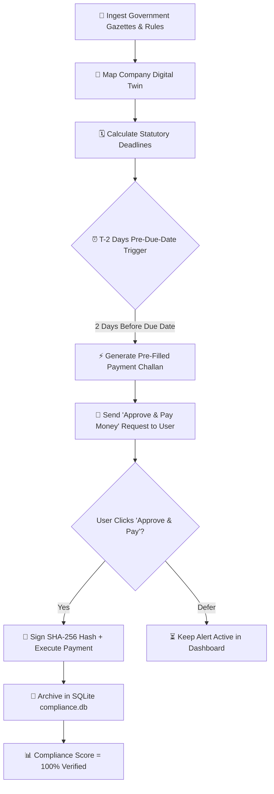

# 🛡️ RegTech AI - Technical Architecture & Presentation Guide

## 1. System Overview & Problem-Solution Matrix
The Autonomous Compliance Platform eliminates manual calendar spreadsheets by deploying proactive agents that compute statutory liabilities and trigger payment authorizations **2 days before every statutory due date**.

---

## 2. Key Modules Implemented

1. **⚡ 2-Day Pre-Due-Date Auto-Payment & Authorization Center** (`paymentEngine.js`):
   - Computes liabilities across GST PMT-06, TDS ITNS 281, and Advance Tax ITNS 280.
   - Schedules authorizations 2 days in advance to guarantee zero late fees.
   - Generates verifiable digital signature receipts (`SIG-SHA256-...`).

2. **📊 Executive Risk Matrix & Compliance Health** (`riskMatrix.js`):
   - Real-time health score gauge (0–100%).
   - Compounding late-fee penalty risk exposure calculator.
   - 1-Click Certified Audit Pack Exporter.

3. **📡 Autonomous Regulatory Radar & Diff Engine** (`regulatoryRadar.js`):
   - Live gazette simulator and AI plain-English impact summaries.

4. **🔍 Multimodal AI Document Auditor** (`documentAuditor.js`):
   - Animated OCR scanner and ledger shortfall detection.

5. **🏢 Company Digital Twin & Entity Profiler** (`entityProfiler.js`):
   - Multi-jurisdiction rules engine for India, US, and EU.

6. **🕸️ Semantic Regulatory Knowledge Graph** (`knowledgeGraph.js`):
   - Interactive canvas visualizer mapping Acts $\to$ Sections $\to$ Obligations $\to$ Payments.

7. **🤖 Autonomous Compliance AI Copilot** (`copilot.js`):
   - Conversational assistant with regulatory Q&A knowledge base.

8. **💾 SQLite Database Engine** (`db.py` & `compliance.db`):
   - Relational tables for users, entities, obligations, payment requests, and immutable audit logs.
